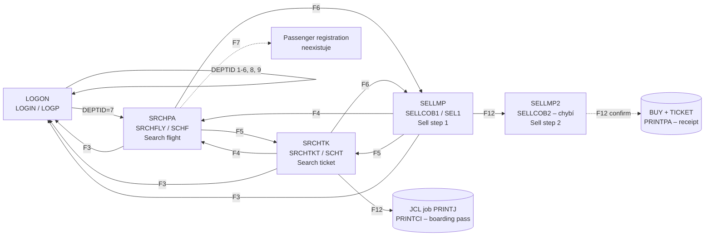
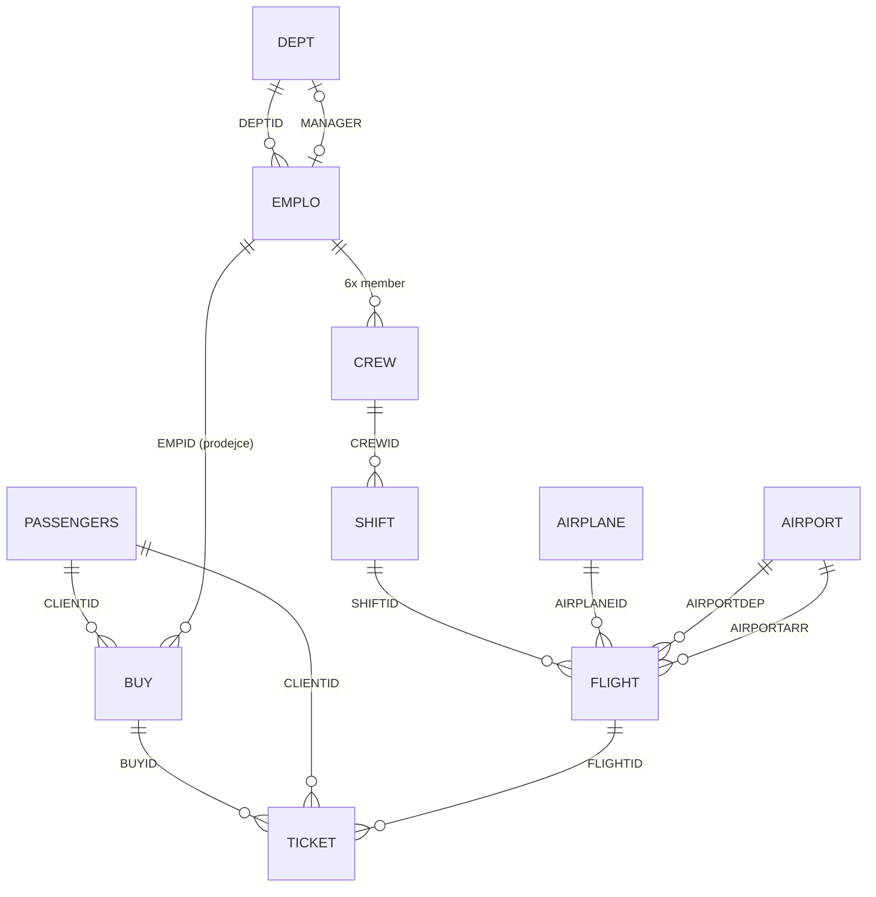

# 01 – Inventář legacy systému COBOL AIRLINES

Dokument vychází výhradně ze zdrojů v tomto repozitáři (větev `main`). Originál nelze spustit (nemáme mainframe, CICS ani DB2), proto jsou všechna tvrzení odvozena z kódu, BMS map, DDL, testovacích dat a snímků obrazovek. Kde kód a snímky obrazovek nesouhlasí, je to výslovně uvedeno.

Autor originálu: „KERESTES“, září–listopad 2022. Původní projekt je osobní výukový projekt (viz `README.md`), ne produkční systém. Tomu odpovídá i kvalita a úplnost kódu.

## 1. Přehled struktury repozitáře

| Adresář | Obsah | Platforma |
|---|---|---|
| `CICS/LOGIN/` | Přihlašovací transakce (program, mapa, ověření hesla) | z/OS, CICS + COBOL + DB2 |
| `CICS/SALES-MAP/` | Obrazovky prodejního oddělení (hledání letů, hledání letenek, prodej) + tiskové dávky | z/OS, CICS + COBOL + DB2, JCL |
| `COB-PROG/` | Dávkové programy pro plnění DB2 (zaměstnanci z JSON, cestující z XML, duplikace letů) | z/OS batch COBOL + DB2 |
| `DB2/` | DDL (`create-db`), naplnění číselníků (`insertion-1..3`), opravný `UPDATE1`, DCLGEN copybooky, ER diagram (PDF) | DB2 for z/OS |
| `AS-400/` | Paralelní, nedokončený port na IBM i: DDS popisy souborů, přihlašovací DSPF, CSV data, import a šifrování hesel | IBM i (AS/400), ILE COBOL |
| `VIDEOS/` | Odkazy na YouTube playlisty s ukázkami | – |

Celkem cca 7 700 řádků textu. Zdrojové soubory nemají standardní přípony a nejsou v přesném sloupcovém formátu COBOL (chybí sekvenční oblast, řádky jsou posunuté) – jde o „upload“ z ISPF, nikoli o repozitář, ze kterého se překládalo.

## 2. Seznam programů

### 2.1 CICS online programy (z/OS)

| PROGRAM-ID | Soubor | Transakce | Mapset / mapa | Účel |
|---|---|---|---|---|
| `LOGIN` | `CICS/LOGIN/LOGIN-COB` | `LOGP` | `LOGINMP` / `LOGON` | Přihlášení: načte `EMPID` + heslo, ověří heslo přes `CRYPTVE`, podle `DEPTID` zaměstnance přesměruje (XCTL) na obrazovku oddělení. Implementováno jen pro Sales (`DEPTID = 7`), ostatní oddělení vrací hlášku „… MAP IS NOT AVAIBLE YET“. |
| `CRYPTVE` | `CICS/LOGIN/CRYPTO-VERIFICATION` | – (CALL) | – | Podprogram volaný z `LOGIN`. Z hesla, `EMPID` a data nástupu (`ADMIDATE`) spočítá „zašifrované“ heslo a porovná je se záznamem v sekvenčním souboru `PASSDOC`. Návratový kód 0 = OK, 1 = neplatné, 2 = chyba souboru. |
| `SRCHFLY` | `CICS/SALES-MAP/SRCHFLY-COB` | `SCHF` | `SRCHFLI` / `SRCHPA` | Hledání letů podle čísla letu, data, letiště odletu, letiště příletu (a jejich kombinací). Zobrazí max. 10 řádků. |
| `SRCHTKT` | `CICS/SALES-MAP/SRCHTKT-COB` | `SCHT` | `SRCHTKT` / `SRCHTK` | Hledání letenek podle ID letenky, ID klienta, jména a příjmení, čísla letu, data letu. Výsledky drží v COMMAREA (max. 20 záznamů, načítá max. 10), stránkuje po jedné letence (F10/F11), F12 odešle JCL job na tisk palubní vstupenky (`PRINTCI`) přes CICS SPOOL (INTRDR). |
| `SELLCOB1` | `CICS/SALES-MAP/SELL1-COB` | `SEL1` | `SELLMS` / `SELLMP` | Prodej – krok 1: zadání ID klienta, čísla letu, data a počtu cestujících; ověří existenci klienta a letu, spočítá cenu (pevně 120.99 za osobu) a předá řízení do `SELLCOB2`. |
| `SELLCOB2` | **chybí** (jen mapa `CICS/SALES-MAP/SELL2-MAP` a snímky `sell2-1.png`, `sell2-2.png`) | (pravděpodobně `SEL2`) | `SELLMS2` / `SELLMP2` | Prodej – krok 2: pro každého cestujícího zadat `CLIENTID`, systém doplní jméno; F12 (dle snímku) potvrdí prodej. Zápis do `BUY` a `TICKET` lze pouze odvodit ze schématu. |

Poznámky:

- `LOGIN` volá `XCTL PROGRAM('SRCHFLI')`, zatímco ostatní programy volají `PROGRAM('SRCHFLY')`. `SRCHFLI` je název mapsetu; jde o nekonzistenci ve zdrojích.
- Ve všech CICS programech je stejný „hlavičkový“ blok obrazovky: `USERID`, `TERMINAL`, `DATE`, `TIME`, titulek „COBOL AIRLINES – PROGRAMMING AT HEIGHTS“, dva řádky hlášek `MSG1`/`MSG2` a nabídka funkčních kláves na řádku 24.
- Zdrojové texty obsahují chyby, které by se nepřeložily (např. v `LOGIN` tečky uvnitř `EVALUATE`, osamocené `ELSE`, zkrácený řádek `CALL … WS-ADMID`; v `SRCHFLY` nedefinované `WS-USERID`/`WS-TERINAL`, `PERFORM 0624 SQL-DAIR`, `OF` místo `OR`). Snímky obrazovek dokazují, že systém běžel, takže nahrané zdroje nejsou přesně tou verzí, která se překládala. Při přepisu je rozhodující zamýšlené chování, nikoli doslovný kód.

### 2.2 Dávkové programy z/OS (`COB-PROG/`, `CICS/SALES-MAP/`)

| PROGRAM-ID | Soubor | Účel |
|---|---|---|
| `EMPINSRT` | `COB-PROG/EMPLO-INSERT/EMPLO-MAIN-INSERT` | Hlavní program importu zaměstnanců. Zavolá `SUINSRT`, dostane tabulku max. 30 zaměstnanců a vloží je do `EMPLO`. |
| `SUINSRT` | `COB-PROG/EMPLO-INSERT/EMPLO-LECTURE-JSON` | Načte `EMPLOYEE-LIST.json` (jeden řádek, max. 13 000 znaků), `JSON PARSE` do tabulky. Transformace: `EMPID = 10000000 + empid` (výsledek `10000001`…), délky VARCHAR polí, datum nástupu z `YYYY/MM/DD` na `MM/DD/YYYY`. Pro každého zaměstnance zavolá `CRYPTPGM` s heslem v otevřeném tvaru. |
| `CRYPTPGM` | `COB-PROG/EMPLO-INSERT/EMPLO-CRYPTO-PASS` | „Šifrování“ hesla (viz kap. 7.1) a zápis dvojice `EMPID` + 8 bajtů hashe do sekvenčního souboru `PASSDOC` (`OPEN EXTEND`). Ukázkový výstup: `EMPLO-OUTPUT-PASS-CRYPT` (30 záznamů). |
| `PASSENG` | `COB-PROG/PASSENGER-INSERT/PASSENGER-INSERT-MAINPROG` | Import cestujících: zavolá `SUXML`, dostane tabulku 80 cestujících a vloží je do `PASSENGERS` (bez `CLIENTID`, ten je identity). Spouští se 8× (soubory `PASSENGER1..8.xml`, 8 × 80 = 640 cestujících). |
| `SUXML` | `COB-PROG/PASSENGER-INSERT/PASSENGER-SUXML-SUBPROG` | Načte XML (UTF-8, jeden řádek do 25 000 znaků), převede kódování 1208 → 1047 (EBCDIC) a `XML PARSE` naplní tabulku; elementy `FIRSTNAME, LASTNAME, ADDRE, CITY, COUNTRY, ZIPCODE, TELEPHONE, EMAIL`. |
| `CBFLIGHT` | `COB-PROG/FLIGHT-DUPLICATE/FLIGHT-DUPLICATE-COB` | Pro 8 čísel letů (`CB1104, CB1105, CB2204, CB2205, CB3304, CB3305, CB4404, CB4405`) načte let a naklonuje jej na dny 2–30 měsíce září (délka měsíce z tabulky `MONTH(9)`). Jde o generátor testovacího letového řádu: každý let létá denně ve stejný čas. |
| `PRINTCI` | `CICS/SALES-MAP/PRINT-TICKET-COB` | Dávka spouštěná z JCL jobu `PRINTJ` (vygenerovaného v `SRCHTKT`). Přes `ACCEPT` načte 10 řádků ze `SYSIN` (jméno, sedadlo, číslo letu, letiště odletu/příletu, datum, čas odletu, datum ve tvaru `DDMMMYYYY`, „město-kód“ pro obě letiště) a vytiskne palubní vstupenku (vzor `TICKET-FORMAT`). |
| `PRINTPA` | `CICS/SALES-MAP/RECEIPT-COB` | Dávka tisku účtenky: `ACCEPT` `BUYID` a celkové ceny, vytiskne účtenku (vzor `RECEIPT-FORMAT`). Platební metoda není implementována (tiskne se konstanta `CB/CS/CH`, číslo karty jako `**********`). Program, který by ji z CICS volal (`SELLCOB2`), chybí. |

### 2.3 AS/400 (IBM i) – paralelní nedokončený port (`AS-400/`)

| Soubor | Typ | Účel |
|---|---|---|
| `DDS-DB/employee, dept, passager, vol, avion, billet, ACHAT, Equipage, shift` | DDS fyzické soubory | Stejný datový model jako DB2, francouzské názvy polí (viz kap. 5.4). |
| `DSPF/LOGIN-DSPF` | DDS display file | Přihlašovací obrazovka, ekvivalent `LOGINMP` (heslo 16 znaků, datum/čas systémové). Program k ní v repu není. |
| `Insert/Emplo-file`, `Insert/Passagers-file` | CSV | Stejná data jako JSON/XML na z/OS (30 zaměstnanců, 640 cestujících), navíc sloupec `passagerid`. |
| `Insert/INSERTCSV` (`ISRTJSON`) | ILE COBOL | Čte indexovaný soubor `EMPLORCV`, vkládá do `EMPLOYEE` (SQL), volá `CRYPTPGM`. Heslo převádí na velká písmena, `EMPID` doplňuje na 8 znaků. |
| `Insert/encryptpgm` (`CRYPTPGM`) | ILE COBOL | Varianta šifrování pro AS/400: heslo do 16 znaků, 4bajtové bloky, sčítání místo násobení. Výstup 8 + 20 bajtů do `FILEPASS`. **Není kompatibilní** se z/OS variantou. |

Pro přepis je AS/400 část pouze doplňková reference (potvrzuje datový model). Cílová aplikace vychází z varianty CICS + DB2.

## 3. CICS mapy (BMS) a toky obrazovek

### 3.1 Seznam map

| Mapset / mapa | Soubor | Program | Vstupní pole (UNPROT) | Výstupní pole |
|---|---|---|---|---|
| `LOGINMP` / `LOGON` | `CICS/LOGIN/LOGINMAP` | `LOGIN` | `USERID` (8), `PASSW` (8, DRK = skryté) | `LDATE`, `LHOUR`, `MSG1`, `MSG2` |
| `SRCHFLI` / `SRCHPA` | `CICS/SALES-MAP/SRCHFLI-MAP` | `SRCHFLY` | `FNUM` (6), `FDATE` (10, initial `YYYY-MM-DD`), `DAIR` (3), `LAIR` (3) | 10 řádků × (`FLIIDn` 6, `FLITDn` 5, `FLITLn` 5, `FLIDEn` 3, `FLILDn` 3, `FLIPLn` 3, `FLIDTn` 10), hlavička, `MSG1/2` |
| `SRCHTKT` / `SRCHTK` | `CICS/SALES-MAP/SRCHTKT-MAP` | `SRCHTKT` | `TKTID` (10), `CLIID` (10), `FNAME` (15), `LNAME` (15), `FLIID` (10), `FDATE` (10) | Detail jedné letenky: `STKTID, SFNAME, SLNAME, SFLIID, STDEP, STLAN, SFDATE, SDAIR, SLAIR, SSEAT`, stránkování `FPAGE` (`n/NN`), `MSG1/2` |
| `SELLMS` / `SELLMP` | `CICS/SALES-MAP/SELL1-MAP` | `SELLCOB1` | `CLIID` (6), `FNUM` (6), `FDATE` (10), `PASSN` (1) | `SFNUM, SFDATE, SDTIME, SLTIME, SDAIR, SLAIR, SPRICE, STPRICE`, `MSG1/2` |
| `SELLMS2` / `SELLMP2` | `CICS/SALES-MAP/SELL2-MAP` | `SELLCOB2` (chybí) | `SCLID1..8` (6 resp. 10) – ID cestujících | Rekapitulace (`CLIID, FNUM, DAIR, LAIR, FDATE, PASSN, PRICE, TPRICE`), `NCLIDn`/`NNAMEn` popisky, `SNAMEn` jména, `MSG1/2` |
| DSPF `LOGINDSP` | `AS-400/DSPF/LOGIN-DSPF` | – | `USERID` (8), `PASSWORD` (16, ND) | `MSG1`, `MSG2` |

### 3.2 Navigace funkčními klávesami

Všechny prodejní obrazovky sdílejí stejnou spodní lištu:

| Klávesa | Akce | Poznámka |
|---|---|---|
| F3 | `XCTL LOGIN` – návrat na přihlášení (odhlášení) | |
| F4 | `XCTL SRCHFLY` – hledání letů | Na vlastní obrazovce hláška „THIS IS THE CURRENT MAP“ |
| F5 | `XCTL SRCHTKT` – hledání letenek | |
| F6 | `XCTL SELLCOB1` – prodej | |
| F7 | Registrace cestujících („PASS REG.“) | **Neimplementováno** – hláška „THIS MAP IS NOT READY YET“ |
| Enter | Provede hledání / validaci na aktuální obrazovce | |

Specifické klávesy:

- `SRCHTKT`: F10 předchozí letenka, F11 další letenka, F12 tisk palubní vstupenky aktuálně zobrazené letenky.
- `SELLCOB1`: F10 „RESEARCH“ (v kódu jen hláška „THIS IS THE CURRENT FUNCTION“; hledání dělá Enter), F12 „INSERT PASSENGERS“ → `XCTL SELLCOB2` s COMMAREA 66 B. Snímek `sell1-1.png` ukazuje popisky F11=RESEARCH / F12=INSERT PASSENGERS, mapa v repu má F10/F12.
- `SELLMP2`: mapa uvádí F10=RETURN, F11=CONFIRM PASSENGERS; snímky ukazují F11=RETURN, F12=CONFIRM PASSENGERS.

### 3.3 Tok obrazovek

Předávání stavu mezi obrazovkami: pseudokonverzační model, `EXEC CICS RETURN TRANSID(...) COMMAREA(...)`. Základní COMMAREA je 12 B (`TRANSACTION` 4 + `USER-ID` 8); `SRCHTKT` si do COMMAREA ukládá celý výsledek hledání (20 × 120 B) kvůli stránkování; `SELLCOB1` → `SELLCOB2` posílá 66 B (uživatel, `FLIGHTID`, `CLIENTID`, číslo letu, letiště, datum, počet osob, cena, celková cena).

## 4. Datový model DB2

Zdroj: `DB2/create-db` (DDL), `DB2/DCLGEN/*`, `DB2/DER-COB-AIRLINES.pdf`. Tabulky jsou v databázi `dbadmin2`, každá má unikátní index nad PK.

### 4.1 Tabulky

**AIRPORT** – letiště

| Sloupec | Typ (DDL) | NULL | Poznámka |
|---|---|---|---|
| `AIRPORTID` | VARCHAR(4) (DCLGEN: CHAR(4)) | NOT NULL, **PK** | Používají se 3znakové IATA kódy (`CDG`, `FCO`, `LIS`, `LHR`, `AMS`, `FRA`, `ISL`, `MAD`, `BOD`). Obrazovky mají pole délky 3. |
| `NAME` | VARCHAR(100) | NOT NULL | |
| `ADDRESS` | VARCHAR(250) | NOT NULL | |
| `CITY` | VARCHAR(30) | NOT NULL | Používá se v tisku palubní vstupenky („PARIS-CDG“). |
| `COUNTRY` | VARCHAR(30) | NULL (DCLGEN: NOT NULL) | |
| `ZIPCODE` | VARCHAR(15) | NOT NULL | |

**AIRPLANE** – letadla

| Sloupec | Typ | NULL | Poznámka |
|---|---|---|---|
| `AIRPLANEID` | CHAR(8) | NOT NULL, **PK** | `BOEING01`…`BOEING04`, `AIRBUS01`…`AIRBUS06` |
| `TYPE` | VARCHAR(8) | NOT NULL | `737-200`, `A320`, … |
| `NUMSEATS` | INT | NOT NULL | Kapacita (130–300) |
| `TOTALFUEL` | INT | NOT NULL | Jednotka neuvedena (hodnoty 26–40) |

**FLIGHT** – konkrétní let v konkrétní den

| Sloupec | Typ | NULL | Poznámka |
|---|---|---|---|
| `FLIGHTID` | INT IDENTITY | NOT NULL, **PK** | Interní ID; na obrazovkách se nikde nezobrazuje |
| `FLIGHTDATE` | DATE | NOT NULL | |
| `DEPTIME` | TIME | NOT NULL | |
| `ARRTIME` | TIME | NOT NULL | |
| `TOTPASS` | INT | NOT NULL | Na obrazovce sloupec „PLACES“. `UPDATE1` nastaví na `AIRPLANE.NUMSEATS` – jde tedy o kapacitu / volná místa; zda se při prodeji snižuje, není v dostupném kódu. |
| `TOTBAGGA` | INT | NOT NULL | `UPDATE1` nastaví na 0; nikde jinde se nepoužívá |
| `FLIGHTNUM` | CHAR(6) | NOT NULL | Obchodní číslo letu `CBnnnn`; **není unikátní** (stejné číslo každý den) |
| `SHIFTID` | INT | NOT NULL, FK → `SHIFT` | Směna posádky |
| `AIRPLANEID` | CHAR(8) | NOT NULL, FK → `AIRPLANE` | |
| `AIRPORTDEP` | VARCHAR(4) | NOT NULL, FK → `AIRPORT` | Letiště odletu |
| `AIRPORTARR` | VARCHAR(4) | NOT NULL, FK → `AIRPORT` | Letiště příletu |

**PASSENGERS** – cestující / klienti

| Sloupec | Typ | NULL | Poznámka |
|---|---|---|---|
| `CLIENTID` | INT IDENTITY | NOT NULL, **PK** | Na obrazovkách „CLIENT ID“ (pole 6 resp. 10 znaků) |
| `FIRSTNAME` | VARCHAR(30) | NOT NULL | `UPDATE1` převádí na velká písmena |
| `LASTNAME` | VARCHAR(30) | NOT NULL | dtto |
| `ADDRESS` | VARCHAR(250) | NOT NULL | |
| `CITY` | VARCHAR(50) | NOT NULL | |
| `COUNTRY` | VARCHAR(30) | NULL (DCLGEN NOT NULL) | |
| `ZIPCODE` | VARCHAR(15) | NOT NULL | |
| `TELEPHONE` | VARCHAR(18) | NOT NULL | |
| `EMAIL` | VARCHAR(100) | NOT NULL | |

**TICKET** – letenka

| Sloupec | Typ | NULL | Poznámka |
|---|---|---|---|
| `TICKETID` | CHAR(10) | NOT NULL, **PK** | Formát `CB` + 8 číslic (`CB00000001`). Generování není v kódu. |
| `BUYID` | INT | NOT NULL, FK → `BUY` | |
| `CLIENTID` | INT | NOT NULL, FK → `PASSENGERS` | Cestující na letence |
| `FLIGHTID` | INT | NOT NULL, FK → `FLIGHT` | |
| `SEAT` | CHAR(3) | NOT NULL | DCLGEN uvádí `SEATNUM`; `SRCHTKT` používá `A.SEAT` v SQL a `:T-SEATNUM` jako host proměnnou. Formát `B04` (písmeno + 2 číslice). Přidělování sedadel není v kódu. |

**EMPLO** – zaměstnanci (uživatelé systému)

| Sloupec | Typ | NULL | Poznámka |
|---|---|---|---|
| `EMPID` | CHAR(8) | NOT NULL, **PK** | Přihlašovací jméno. `10000001`…`10000039`. |
| `FIRSTNAME` | VARCHAR(30) | NOT NULL | |
| `LASTNAME` | VARCHAR(30) | NOT NULL | |
| `ADDRE` | VARCHAR(100) | NOT NULL | |
| `CITY` | VARCHAR(50) | NOT NULL | |
| `ZIPCODE` | VARCHAR(15) | NOT NULL | |
| `TELEPHONE` | VARCHAR(10) | NOT NULL | |
| `EMAIL` | VARCHAR(100) | NOT NULL | |
| `ADMIDATE` | DATE | NOT NULL | Datum nástupu; vstupuje do výpočtu hashe hesla |
| `SALARY` | DEC(8,2) | NOT NULL | |
| `DEPTID` | INT | NOT NULL, FK → `DEPT` | Určuje roli |

**DEPT** – oddělení

| Sloupec | Typ | NULL | Poznámka |
|---|---|---|---|
| `DEPTID` | INT | NOT NULL, **PK** | 1–9, viz kap. 6 |
| `NAME` | VARCHAR(20) | NOT NULL | |
| `MANAGER` | CHAR(8) | NULL, FK → `EMPLO` | Cyklická vazba `EMPLO.DEPTID` ↔ `DEPT.MANAGER` |

**BUY** – nákup (obchodní případ, jeden nákup = více letenek)

| Sloupec | Typ | NULL | Poznámka |
|---|---|---|---|
| `BUYID` | INT IDENTITY | NOT NULL, **PK** | Tiskne se na účtence |
| `BUYDATE` | DATE | NOT NULL | |
| `BUYTIME` | TIME | NOT NULL | |
| `PRICE` | DEC(7,2) | NOT NULL | Celková cena nákupu (dle `SELLCOB1` = cena × počet osob) |
| `EMPID` | CHAR(8) | NOT NULL, FK → `EMPLO` | Prodejce (přihlášený uživatel) |
| `CLIENTID` | INT | NOT NULL, FK → `PASSENGERS` | Objednávající klient |

**CREW** – posádka

| Sloupec | Typ | NULL | Poznámka |
|---|---|---|---|
| `CREWID` | INT IDENTITY | NOT NULL, **PK** | |
| `COMMANDER`, `COPILOTE`, `FACHIEF`, `FLIATTENDANT1..3` | CHAR(8) | NOT NULL, FK → `EMPLO` | 6 členů; AS/400 varianta má 7 (4 letušky) |

**SHIFT** – směna posádky

| Sloupec | Typ | NULL | Poznámka |
|---|---|---|---|
| `SHIFTID` | INT IDENTITY | NOT NULL, **PK** | |
| `SHIFTDATE` | DATE | NOT NULL | |
| `BEGINTIME`, `ENDTIME` | TIME | NOT NULL | |
| `CREWID` | INT | NOT NULL, FK → `CREW` | |

### 4.2 Vztahy

Všechny cizí klíče jsou `ON DELETE RESTRICT`. Cyklus `EMPLO ↔ DEPT` je řešen dodatečným `ALTER TABLE emplo ADD FOREIGN KEY`.

### 4.3 Nesrovnalosti mezi DDL, DCLGEN, ER diagramem a kódem

| Kde | Nesrovnalost | Doporučení pro cíl |
|---|---|---|
| `TICKET.SEAT` vs. DCLGEN `SEATNUM` | Různé názvy téhož sloupce | Použít `seat` |
| `AIRPORT.AIRPORTID` VARCHAR(4) vs. CHAR(4); `FLIGHT.AIRPORTDEP/ARR` VARCHAR(4) vs. CHAR(4) | Typ | `varchar(4)`, data 3 znaky (IATA) |
| `AIRPORT.COUNTRY`, `PASSENGERS.COUNTRY` | DDL NULL, DCLGEN NOT NULL | NOT NULL (data vždy vyplněna) |
| ER diagram `EMPLOYEE.EMPID SERIAL` vs. DDL `EMPLO.EMPID CHAR(8)` | Název tabulky i typ | `CHAR(8)`/`varchar(8)` dle DDL a kódu |
| ER diagram `DEPT.DEPTID VARCHAR(50)`, `NOME VARCHAR(8)` | Prohozené typy; DDL má `DEPTID INT`, `NAME VARCHAR(20)` | Dle DDL |
| `FLIGHT` DCLGEN komentář „9 columns“ | Skutečně 11 | – |
| `EMPLO.TELEPHONE` VARCHAR(10) vs. `PASSENGERS.TELEPHONE` VARCHAR(18) | Nekonzistentní délky | Sjednotit na 20 |
| `SRCHTKT` host proměnné `:T-TICKETID`, `:T-SEATNUM` | V DCLGEN bez prefixu `T-` | – |
| Formáty datumů v insert skriptech | `'01/09/2022'` (CB2204) vs. `'09/01/2022'` (ostatní lety), `'10/21/2018'` (US), `'02/02/202&'` (překlep). `CBFLIGHT` předpokládá září → US formát `MM/DD/YYYY` | Vše převést na ISO, sample data brát jako „září 2022“ |
| Sample data FK | `insertion-3` vkládá do `CREW` `'100000012'` a `'100000032'` (9 znaků, neexistují), `SHIFT` odkazuje `CREWID 6, 21, 22, 23`, `FLIGHT` na `SHIFTID 9, 21–23`, `TICKET` na `BUYID 3`, `FLIGHTID 4`, `CLIENTID 6` – hodnoty identity závislé na pořadí spouštění v původním prostředí | Seed pro novou aplikaci vytvořit konzistentně od nuly |
| `LOGINMP` `PASSW` 8 znaků vs. AS/400 16 znaků; `EMPLOYEE-LIST.json` má hesla dlouhá až 12 znaků | CICS varianta hesla mlčky zkracuje na 8 | Nová aplikace: bez limitu 8 |

## 5. Copybooky a datové struktury

### 5.1 DCLGEN (`DB2/DCLGEN/`)

| Copybook | Tabulka | Struktura | Použit v |
|---|---|---|---|
| `AIRPORT-DCLGEN` | `AIRPORT` | `DCLAIRPORT`, prefix `AIR-`, VARCHAR jako `49 _LEN` + `49 _TEXT` | `SRCHTKT` (název města pro tisk) |
| `EMPLO-DCLGEN` | `EMPLO` | `DCLEMPLO`, bez prefixu | `LOGIN`, `EMPINSRT` |
| `FLIGHT-DCLGEN` | `FLIGHT` | `DCLFLIGHT`, bez prefixu | `SRCHFLY`, `SRCHTKT`, `SELLCOB1`, `CBFLIGHT` |
| `PASSENG-DCLGEN` | `PASSENGERS` | `DCLPASSENGERS`, prefix `PA-` | `SRCHTKT`, `SELLCOB1`, `PASSENG` |
| `TICKET-DCLGEN` | `TICKET` | `DCLTICKET`, bez prefixu | `SRCHTKT` |

DCLGEN pro `BUY`, `CREW`, `SHIFT`, `DEPT`, `AIRPLANE` v repu nejsou (žádný program s nimi nepracuje).

### 5.2 CICS copybooky

- `LOGINMP`, `SRCHFLI`, `SRCHTKT`, `SELLMS` – symbolické mapy generované z BMS (pole `xxxI`/`xxxO`/`xxxL`/`xxxA`).
- `DFHAID` (konstanty kláves `DFHPF3`…), `DFHBMSCA` (atributy) – standardní CICS.

### 5.3 Pracovní struktury s významem pro business

| Struktura | Program | Význam |
|---|---|---|
| `WS-COMMAREA` (12 B) | všechny | `TRANSACTION` + `USER-ID` – identita přihlášeného |
| `WS-COMMAREA` (2 432 B) | `SRCHTKT` | + `F11-PAGE` (aktuální stránka), `TPAGE` (počet stránek), `TERMINAL`, 20 × záznam letenky (`TICKETID, FIRSTNAME, LASTNAME, FDATE, DEPTIME 5, ARRTIME 5, FLIGHTNUM, AIRPORTDEP 3, AIRPORTARR 3, SEATNUM`) |
| `WS-COMMAREA` (66 B) | `SELLCOB1` → `SELLCOB2` | `FLIGHTID 9(9)`, `CLIID 9(6)`, `FNUM X(6)`, `DAIR X(3)`, `LAIR X(3)`, `FDATE X(10)`, `PASSN 9(1)`, `PRICE 9(5)V99`, `TPRICE 9(7)V99` |
| `JCL-JOB` | `SRCHTKT` | Šablona JCL `PRINTJ` (`EXEC PGM=PRINTCI`, `STEPLIB Z13896.PROJ1.LOADLIB`) + 10 řádků `SYSIN` |
| `TOTFILE` | `CRYPTPGM`, `CRYPTVE` | Záznam souboru `PASSDOC`: `FILE-USERID X(8)`, `FILE-PASS X(8)`, `FILLER X(4)` |
| `WS-EMPLIST` / `F-EMPLIST` | `SUINSRT`, `EMPINSRT` | 30 zaměstnanců z JSON (včetně `PASSW` v otevřeném tvaru) |
| `PASSENGER-LIST` | `SUXML`, `PASSENG` | 80 (resp. 81) cestujících z XML |
| `WS-FLIGHT` (31 × let) | `CBFLIGHT` | Šablona letu pro každý den měsíce |

### 5.4 Mapování názvů AS/400 (DDS) → DB2

| DDS soubor | DB2 tabulka | Odlišnosti |
|---|---|---|
| `EMPLOYEE` | `EMPLO` | `EMPLOYEEID 10S0` (číslo), `PRENOM/NOM/ADRESSE/VILLE/CODEPOSTAL`, `ADMINDATE` |
| `DEPT` | `DEPT` | `NAME 50A`, `DIRECTEUR` = `MANAGER` |
| `PASSAGER` | `PASSENGERS` | `PAYS` = `COUNTRY`, `TELEPHONE 20A` |
| `VOL` | `FLIGHT` | `VOLDATE, HSORTIE, HARRIVEE, TOTBAGAGE, NBRVOL` = `FLIGHTNUM`, `PERSOID` = `SHIFTID`, `AERSORTIE/AERARRIVEE` |
| `AVION` | `AIRPLANE` | `NBRSIEGE` = `NUMSEATS`, `TESSENCE` = `TOTALFUEL` |
| `BILLET` | `TICKET` | `BILLETID 10A`, `ACHATID`, `VOLID`, `SIEGE` |
| `ACHAT` | `BUY` | `ACHATDATE, ACHATHEURE, PRIX, EMPLOYEID` |
| `EQUIPE` | `CREW` | `CAPITAINE, COPILITE, FARESP, FA2, FA3, FA4` (7 členů) |
| `SHIFT` | `SHIFT` | `HEUREDEBUT, HEUREFIN, EQUIPEID` |

## 6. Uživatelské role a stav implementace

Role = oddělení zaměstnance (`EMPLO.DEPTID` → `DEPT`). Číselník z `DB2/insertion-1`:

| `DEPTID` | `DEPT.NAME` | Role dle README | Manažer (`insertion-2`) | Počet uživatelů v testovacích datech | Chování po přihlášení (`LOGIN`) | Stav |
|---|---|---|---|---|---|---|
| 1 | `ceo` | CEO | `10000029` | 1 | „THE CEO MAP IS NOT AVAIBLE YET“ | Neimplementováno |
| 2 | `commander` | Air Staff | – | 3 (+1) | „THE CREW MAP IS NOT AVAIBLE YET“ | Neimplementováno |
| 3 | `copilote` | Air Staff | – | 3 (+1) | dtto | Neimplementováno |
| 4 | `Flight Attendant` | Air Staff | – | 9 (+7) | dtto | Neimplementováno |
| 5 | `Human resources` | HR | `10000013` | 2 | „THE HR MAP IS NOT AVAIBLE YET“ | Neimplementováno |
| 6 | `Suport IT` | IT Support | `10000027` | 3 | „THE IT MAP IS NOT AVAIBLE YET“ | Neimplementováno |
| 7 | `Sales` | Sales | `10000019` | 5 | `XCTL SRCHFLY` | **Částečně hotovo** (viz níže) |
| 8 | `Legal` | (v README chybí) | `10000017` | 1 | „THE LAWYER MAP IS NOT AVAIBLE YET“ | Neimplementováno |
| 9 | `Schedule` | Schedule | `10000022` | 3 | „THE SCHEDULE MAP IS NOT AVAIBLE YET“ | Neimplementováno |

Stav funkcí role Sales:

| Funkce | Stav v originálu | Stav v nové aplikaci |
|---|---|---|
| Přihlášení / odhlášení | Hotovo | Hotovo (včetně limiteru) |
| Hledání letů (`SRCHFLY`) | Hotovo | Hotovo |
| Hledání letenek (`SRCHTKT`) včetně stránkování | Hotovo | Hotovo |
| Tisk palubní vstupenky (`PRINTCI`) | Hotovo (tisk přes JES, hláška „TICKET PRINTED“ na snímku) | Hotovo (tiskové HTML) |
| Prodej – krok 1 (`SELLCOB1`) | Hotovo | Hotovo |
| Prodej – krok 2 (`SELLCOB2`) | Obrazovka existuje a dle snímků fungovalo dohledání jmen; zdroj chybí, zápis prodeje neověřitelný | Hotovo |
| Tisk účtenky (`PRINTPA`) | Program hotov, volání chybí; platební metoda neimplementována | Hotovo (platební metoda se neeviduje) |
| Registrace / správa cestujících (F7) | Neimplementováno | Hotovo |
| Výpočet ceny | Pevná konstanta 120.99 s komentářem, že má vzniknout samostatný program | Hotovo (cena letu × počet cestujících) |

Ostatní role nemají žádné obrazovky ani programy. Pro ně existuje pouze datový model (`CREW`, `SHIFT`, `EMPLO`, `DEPT`, `AIRPLANE`), plněný ručně SQL skripty a dávkami.

## 7. Business pravidla vyčtená z kódu

### 7.1 Přihlášení a hesla

1. Uživatel zadá `USERID` (= `EMPLO.EMPID`, 8 znaků) a heslo (max. 8 znaků, skryté pole).
2. `LOGIN` vyhledá `ADMIDATE` a `DEPTID` v `EMPLO`. `SQLCODE 100` (neexistuje) → „PASSWORD OR USERID INCORRECT.“ (stejná hláška jako pro špatné heslo – nerozlišuje se). Jiná chyba → „COMMUNICATION ERROR IN THE SYSTEM CALL THE IT DEPT“ + kód.
3. `CRYPTVE` spočítá hash a porovná s `PASSDOC`. Algoritmus (`CRYPTPGM`/`CRYPTVE`, z/OS varianta):
   - seed = `ADMIDATE` jako číslo `YYYYMMDD`; `KEY = FUNCTION RANDOM(seed) * 1000`;
   - pro každý znak hesla (do 8 nebo do první mezery) se vezmou 2bajtové úseky hesla a `USERID` jako binární čísla; podle `counter MOD 3` se násobí s `KEY` (větev 0), s `USERID` (větev 1) nebo vše dohromady (větev 2); výstupní znak je druhý bajt výsledku; vnitřní smyčka opakuje, dokud výstupní bajt je jeden z `X'00' X'10' X'20' X'30' X'40'` (netisknutelné / mezera v EBCDIC);
   - výsledek: 8 bajtů, uložen s `USERID` do sekvenčního souboru `PASSDOC` (ukázka `EMPLO-OUTPUT-PASS-CRYPT`).
   - Jde o **domácí, nekryptografický a nepřenositelný** algoritmus (závisí na implementaci `FUNCTION RANDOM` v IBM Enterprise COBOL a na EBCDIC). Hashe **nelze** zmigrovat ani ověřit mimo mainframe.
4. Po úspěchu se podle `DEPTID` přejde na obrazovku oddělení (pouze 7 = Sales).
5. Čas na obrazovce: `LOGIN` a `SELLCOB1` berou čas z CICS (`ASKTIME`, což je UTC/GMT) a **přičítají 1 hodinu** (`23 → 0`) – ruční korekce na středoevropský čas. `SRCHFLY`/`SRCHTKT` používají `FUNCTION CURRENT-DATE` bez korekce. Datum zobrazeno jako `DD/MM/YYYY`.

### 7.2 Hledání letů (`SRCHFLY`)

1. Vstupy: `FNUM` (6), `FDATE` (10, výchozí text `YYYY-MM-DD` se chápe jako nevyplněno), `DAIR` (3), `LAIR` (3).
2. Kombinace se kódují do `COUNT1` (jednotky = číslo letu, desítky = datum, stovky = odlet, tisíce = přílet). Letiště se berou v úvahu **jen když není zadáno číslo letu**.
3. Použité dotazy (všechny vrací `FLIGHTDATE, DEPTIME, ARRTIME, TOTPASS, FLIGHTNUM, AIRPORTDEP, AIRPORTARR`, bez `ORDER BY`, max. 10 řádků):

| Kombinace | Podmínka `WHERE` |
|---|---|
| jen číslo letu | `FLIGHTDATE >= dnes AND FLIGHTNUM > :FNUM` (v kódu `>`; snímek `SRCHFLY2.png` ukazuje lety se **stejným** číslem, tj. zamýšleno `=`) |
| jen datum | `FLIGHTDATE = :FDATE` |
| číslo letu + datum | `FLIGHTDATE = :FDATE AND FLIGHTNUM = :FNUM` |
| letiště odletu (± datum) | `FLIGHTDATE = :FDATE AND AIRPORTDEP = :DAIR`; bez data se dosadí dnešní datum |
| letiště příletu (± datum) | `FLIGHTDATE = :FDATE AND AIRPORTARR = :LAIR`; dtto |
| odlet + přílet (± datum) | `FLIGHTDATE = :FDATE AND AIRPORTDEP = :DAIR AND AIRPORTARR = :LAIR`; dtto |
| nic | „NO DATA INSERT, TRY AGAIN“ |

4. Validace data: `YYYY-MM-DD` (4 číslice, `-`, 2 číslice, `-`, 2 číslice), jinak „WRONG DATE FORMAT, TRY TO INSERT DATE AS YYYY-MM-DD“.
5. Prázdný výsledek: v kódu bez zvláštní hlášky (obrazovka zůstane prázdná).
6. Chyba DB: „DB2 ERROR, CALL THE IT DEPARTMENT“ + `SQLCODE`/`SQLSTATE`.
7. Zobrazené sloupce: `FID` (číslo letu), `TDEP`, `TLAND` (HH:MM), `DEP`, `LAND` (kódy letišť), `PLACES` (`TOTPASS`), `DATE`.

### 7.3 Hledání letenek (`SRCHTKT`)

1. Vstupy: `TKTID`, `CLIID`, `FNAME`, `LNAME`, `FLIID` (ve skutečnosti číslo letu `FLIGHTNUM`, ne `FLIGHTID`), `FDATE`.
2. Platné kombinace (priorita shora):

| Kód | Podmínka |
|---|---|
| 1 | `TICKETID = :TKTID` |
| 10 | `CLIENTID = :CLIID` |
| 11 | `CLIENTID` + `FLIGHTNUM` |
| 12 | `CLIENTID` + `FLIGHTDATE` |
| 100 | `FIRSTNAME = :FNAME AND LASTNAME = :LNAME` (přesná shoda; jména jsou v DB velkými písmeny) |
| 101 | jméno + `FLIGHTNUM` |
| 102 | jméno + `FLIGHTDATE` |
| jinak | „A VALIDE RESEARCHS MUST HAVE AT LEAST: TICKTID / OR CLIENTID OR CLIENT'S FIRST AND LAST NAME“ |

3. SQL: `TICKET JOIN PASSENGERS JOIN FLIGHT`, sloupce `TICKETID, SEAT, FIRSTNAME, LASTNAME, FLIGHTDATE, DEPTIME, ARRTIME, FLIGHTNUM, AIRPORTDEP, AIRPORTARR`. Načte se max. 10 záznamů, zobrazí se vždy jeden (stránka `n/NN`).
4. Bez výsledku: „NO DATA MATCH WITH THIS INSERT INFORMATION“.
5. F10/F11 mimo rozsah: „THERE IS NO PREVIOUS PAGE“ / „THERE IS NO NEXT PAGE“.
6. F12 tisk bez předchozího hledání: „IT IS NECESSARY TO DO A VALID RESEARCH BEFORE“. Jinak se sestaví JCL job a odešle přes `SPOOLOPEN/SPOOLWRITE/SPOOLCLOSE` na `INTRDR`; hláška „TICKET SUCCESSFULLY PRINTED“ / „ERROR IN THE PRINT PROCESS“ (snímek: „TICKET PRINTED“).
7. Data pro tisk: celé jméno („FIRST LAST“), sedadlo, číslo letu, kódy letišť, datum ISO, čas odletu (HH:MM), datum `DDMMMYYYY` (např. `01SEP2022`), „`CITY`-`KÓD`“ pro obě letiště (z `AIRPORT.CITY`).

### 7.4 Prodej – krok 1 (`SELLCOB1`)

1. Vstupy: `CLIID` (6 číslic), `FNUM` (6), `FDATE` (10), `PASSN` (1 číslice).
2. Validace v pořadí (první chyba zastaví):
   - `CLIID` číselné a ≠ 0 → jinak „YOU MUST INSERT A NUMBER IN THE CLIENTID“;
   - `FNUM` neprázdné → „YOU MUST INSERT A CORRECT FIGHT NUMBER“;
   - `FDATE` ve tvaru `YYYY-MM-DD` → „THE CORRECT DATA FORMAT IS: YYYY-MM-DD“;
   - `PASSN` číselné a ≠ 0 → „YOU MUST INSERT A NUMBER IN THE NUMBER OF CLIENTS“ (tj. 1–9 osob).
3. `SELECT FIRSTNAME, LASTNAME FROM PASSENGERS WHERE CLIENTID = :CLIID` → `SQLCODE 100`: „THIS PASSENGER DOES NOT EXIST“.
4. `SELECT FLIGHTID, DEPTIME, ARRTIME, AIRPORTDEP, AIRPORTARR FROM FLIGHT WHERE FLIGHTDATE = :FDATE AND FLIGHTNUM = :FNUM` → `SQLCODE 100`: „THIS FLIGHT DOES NOT EXIST“. (Předpokládá se nejvýše jeden let daného čísla v daný den.)
5. Cena: `PRICE = 120.99` (konstanta, komentář: „IT WILL BE BETTER CALL A PROGRAM TO CALCULATE THE PRICE BUT THIS PROGRAM IS NOT ALREADY YET“); `TOTAL PRICE = PRICE × PASSN`. Zobrazeno s `$` (edit maska `$$$$9.99`), přestože účtenka uvádí EUR.
6. Kontrola kapacity letu (`TOTPASS`) se **neprovádí**.
7. F12 bez úspěšného hledání: „YOU NEED TO MAKE A VAIBLE REASEARC BEFORE GO TO THE SELL SCREEN“. Jinak přechod na `SELLCOB2` s daty v COMMAREA.

### 7.5 Prodej – krok 2 (`SELLCOB2`, odvozeno z mapy a snímků)

1. Vlevo rekapitulace: `CLIENT ID`, `FLIGHT NUM`, `AIRPORT DEP`, `AIRPORT LAND`, `DATE`, `PASS NUMBER`, `PRICE`, `TOT PRICE`.
2. Vpravo tolik řádků `CLIENTID: ____ NAME: ______`, kolik je `PASS NUMBER` (max. 8 dle mapy; `PASSN` je 1 číslice, tedy prakticky 1–8). První řádek je předvyplněn objednávajícím klientem (`CLIENTID 100 → EDITH DWELLY`). Uživatel zadá ID dalších cestujících, systém dohledá jméno.
3. F12 „CONFIRM PASSENGERS“: očekávaný zápis (není ve zdrojích) – jeden řádek `BUY` (`BUYDATE`, `BUYTIME`, `PRICE = TOT PRICE`, `EMPID = přihlášený`, `CLIENTID = objednávající`) a `PASSN` řádků `TICKET` (`TICKETID`, `BUYID`, `CLIENTID` cestujícího, `FLIGHTID`, `SEAT`). Generování `TICKETID` (`CB` + 8 číslic) a přidělení sedadla nejsou nikde specifikovány. Následně tisk účtenky `PRINTPA` (`BUYID`, celková cena).
4. F11/F10 „RETURN“: návrat na krok 1.

### 7.6 Letový řád a data

1. Číslo letu `CBnnnn`; lety tvoří páry tam/zpět (`CB1104` CDG→LIS 10:00–15:00, `CB1105` LIS→CDG 17:00–20:00; `CB2204/05` CDG↔FCO; `CB3304/05` CDG↔AMS; `CB4404/05` CDG↔LHR). Jediný hub je `CDG`.
2. Každý let létá každý den v měsíci ve stejný čas se stejným letadlem a stejnou směnou (`CBFLIGHT` klonuje den 1 na dny 2–30; `SHIFTID` se nemění, tedy jedna směna pokrývá celý měsíc – zjevné zjednodušení).
3. `TOTPASS` = `NUMSEATS` letadla; `TOTBAGGA` = 0.
4. Jména cestujících jsou v DB velkými písmeny; příjmení i jméno.
5. Identifikátory zaměstnanců `1000` + 4 číslice; hesla zaměstnanců v testovacích datech jsou uložena v otevřeném tvaru v `EMPLOYEE-LIST.json` a `Emplo-file` (např. `10000001` / `zMKdQYb`, `10000006` / `kxXRk7GIHw` – prodejce ze snímků).

### 7.7 Tiskové výstupy

- **Palubní vstupenka** (`TICKET-FORMAT`, 95 znaků na řádek, 10 řádků): levá část – „BORDING PASS / COBOL AIRLINES“, jméno cestujícího, sedadlo, „FROM: PARIS-CDG TO: ROME-FCO“, „FLIGHTID – CB2204 / DATE – 01SEP2022 / DEPARTURE = 10:00“; pravá část (útržek) – jméno, FROM/TO kódy, FLIGHT, DATE, SEAT.
- **Účtenka** (`RECEIPT-FORMAT`): „RECEIPT“, `BUYID`, `CB/CS/CH` (typ platby – neimplementováno), datum a čas, „COBOL AIRLINES / PARIS / 75000“, maskované číslo karty, „MONTANT = … EUR“, „DEBIT/CREDIT“, „TICKET CLIENT TO KEEP“.

## 8. Testovací data v repozitáři

| Entita | Zdroj | Počet |
|---|---|---|
| `DEPT` | `DB2/insertion-1`, manažeři `insertion-2` | 9 |
| `AIRPORT` | `insertion-2` (CDG, BOD, FCO, LIS), `insertion-3` (LHR, AMS, FRA, ISL, MAD) | 9 |
| `AIRPLANE` | `insertion-2` (BOEING01, AIRBUS01, AIRBUS02), `insertion-3` (BOEING02–04, AIRBUS03–06) | 10 |
| `EMPLO` | `EMPLOYEE-LIST.json` (30, `10000001`–`10000030`), `insertion-3` (9, `10000031`–`10000039`) | 39 |
| `PASSENGERS` | `PASSENGER1..8.xml` (640), `insertion-2` (Maxime Duprat) | 641 |
| `CREW` | `insertion-2` (1), `insertion-3` (3) | 4 (dvě posádky obsahují neplatné `EMPID`) |
| `SHIFT` | `insertion-2` (1), `insertion-3` (3) | 4 |
| `FLIGHT` | `insertion-2` (CB2204), `insertion-3` (7 letů) + `CBFLIGHT` (× 30 dnů) | 8 vzorů → 240 |
| `BUY` / `TICKET` | `insertion-2` | 1 / 1 (`CB00000001`, sedadlo `B04`) |

Data jsou fiktivní (generátor typu Mockaroo), mohou být použita jako seed vývojové databáze.

## 9. Co je nejasné nebo chybí

1. **`SELLCOB2`** – zdroj chybí; není známo, jak se generuje `TICKETID`, jak se přiděluje `SEAT`, zda se snižuje `FLIGHT.TOTPASS`, zda se kontroluje kapacita, zda se ukládá `BUY.PRICE` jako celková cena, a zda/jak se volá tisk účtenky. **Rozhodnutí pro cíl:** viz `02-functional-spec.md` (UC-S06).
2. **Výpočet ceny** – v originálu konstanta 120.99; ceník neexistuje. Cíl: cena na letu (nový sloupec) s výchozí hodnotou 120.99.
3. **Registrace cestujících (F7)** – obrazovka neexistuje; cíl ji definuje z tabulky `PASSENGERS`.
4. **Obrazovky ostatních rolí** (CEO, Air Staff, HR, IT, Legal, Schedule) – neexistují; jejich náplň je odvozena z datového modelu a z názvů oddělení. Jde o návrh, ne o rekonstrukci.
5. **Hesla** – nemigrovatelná; nová aplikace musí hesla znovu nastavit (pro vývoj lze použít otevřená hesla z JSON).
6. **Měna** – obrazovka `$`, účtenka `EUR`. Cíl: EUR.
7. **Časová zóna** – ruční +1 h; cíl `Europe/Paris`.
8. **`FLIGHTNUM` vs. `FLIGHTID`** – obrazovky uvádějí „FLIGHT ID“, ale vždy jde o obchodní číslo letu; `FLIGHTID` (identity) je jen interní.
9. **Unikátnost** – v DB nic nebrání dvěma letům se stejným `FLIGHTNUM` ve stejný den; `SELLCOB1` s tím počítá jako s jednoznačným. Cíl: unikátní constraint (`FLIGHTNUM`, `FLIGHTDATE`).
10. **Uložení prodejce** – `BUY.EMPID` je zamýšleno jako přihlášený uživatel (`USER-ID` v COMMAREA), nikde neověřeno.
11. **`TOTBAGGA`, `TOTALFUEL`** – bez použití; cíl je přenese jako informativní pole.
12. **Legal (`DEPTID 8`)** – v README chybí, v DB a v `LOGIN` existuje. Cíl s rolí počítá (bez vlastních obrazovek).
13. **Formát ID letenky** `CB` + 8 číslic – jediný příklad `CB00000001`; cíl: sekvence.
14. **Sedadla** – formát `B04`; rozložení kabiny neexistuje. Cíl: sedadlo = písmeno řady A–F + pořadí, přidělováno automaticky, viz spec.
15. **Zdroje nejsou kompilovatelné 1:1** – chování odvozeno z kombinace kódu a snímků.
