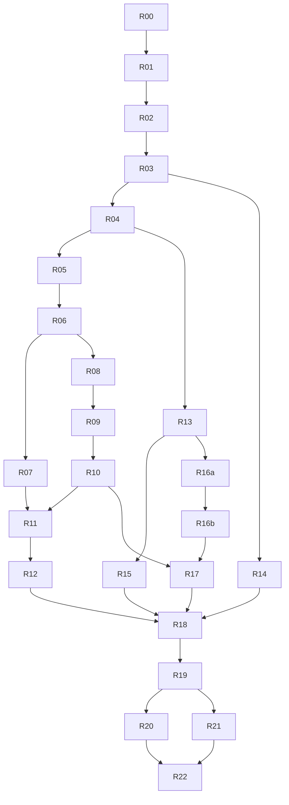

# 04 – Plán migrace po krocích

Podrobné, samostatně vložitelné zadání každého kroku je v `docs/rewrite/codex-tasks/<ID>.md`; tento plán je přehled a definice pořadí. Každý krok = jeden PR od Codexu do větve `rewrite`, větev `codex/<ID>-<slug>` (např. `codex/R05-search-flights`). Krok musí být samostatně mergovatelný: po merge aplikace stále běží, `make check` prochází, nic není „napůl“. Velikost: S = do ~300 řádků změn, M = do ~800, L = do ~1500 (včetně testů a šablon). Větší práci dělíme.

Pořadí je závazné pro závislosti; kroky bez vzájemné závislosti (např. R13 a R15) lze dělat paralelně.

Společná akceptační kritéria pro **každý** krok (viz `AGENTS.md`):

- `make check` (lint + unit + view testy) prochází lokálně.
- Nové chování má testy; nové modely mají migrace (`makemigrations --check` čisté).
- Záznam v `docs/rewrite/CHANGELOG.md`.
- Legacy adresáře (`CICS/`, `COB-PROG/`, `DB2/`, `AS-400/`, `VIDEOS/`, `README.md` v kořeni) nezměněny.
- Žádné soubory v `.github/workflows/`.

---

## ✔ R00 (#1) – Analýza a dokumentace (tento PR, Claude)

- **Cíl:** inventář, funkční specifikace, architektura, plán, pravidla spolupráce.
- **Rozsah:** `docs/rewrite/01–04`, `AGENTS.md`, `CLAUDE.md`, `docs/rewrite/CHANGELOG.md`.
- **Akceptace:** dokumenty existují; plán má kroky s ID.
- **Závislosti:** –

## ✔ R01 (#5) – Scaffolding projektu, Docker Compose, tooling (S–M)

- **Cíl:** spustitelná prázdná Django aplikace s PostgreSQL v Docker Compose a jednotnými příkazy.
- **Rozsah:**
  - `app/` dle `03-target-architecture.md` kap. 3: `pyproject.toml` (Django 5.x, `psycopg[binary]`, `django-environ` nebo `dj-database-url`, `argon2-cffi`, `pytest`, `pytest-django`, `factory-boy`, `ruff`), `manage.py`, `config/settings/{base,dev,test}.py`, `config/urls.py`.
  - `Dockerfile`, `docker-compose.yml` (služby `db`, `web`; profil `e2e` zatím jen připravený), `Makefile` (cíle kap. 8.3), `.env.example`, `.gitignore`, `.dockerignore`.
  - `core` app: `base.html` (hlavička s titulkem, datum/čas `Europe/Paris`, oblast hlášek, prázdné menu), stránka `/` s textem „COBOL AIRLINES“, `/healthz/` vracející `{"status": "ok", "db": true}`.
  - `tests/conftest.py`, jeden view test na `/healthz/`.
  - `app/README.md`: jak spustit, jak testovat.
  - Vendorované `static/pico.min.css`, `static/htmx.min.js`.
- **Akceptace:** `make up && make migrate` → `http://localhost:8000/healthz/` vrací OK; `make check` zelené; `ruff` čisté; `TIME_ZONE='Europe/Paris'`, `USE_TZ=True`.
- **Závislosti:** R00.

## ✔ R02 (#7) – Datové schéma (M)

- **Cíl:** všech 10 legacy tabulek jako Django modely s integritou dle `03` kap. 4.
- **Rozsah:**
  - `accounts.User` (custom, `AUTH_USER_MODEL`), `accounts.Department`, `accounts.Employee`; `fleet.Airport`, `fleet.Airplane`; `operations.Crew`, `operations.Shift`, `operations.Flight`; `sales.Passenger`, `sales.Buy`, `sales.Ticket`.
  - `db_table`/`db_column` = legacy názvy; constraints: `UNIQUE(flightnum, flightdate)`, `UNIQUE(flightid, seat)`, `UNIQUE(flightid, clientid)`, `CHECK airportdep <> airportarr`, `CHECK begintime < endtime`, `CHECK numseats > 0`; indexy z `02` kap. 7; `flight.price` default 120.99; sekvence `ticket_ticketid_seq` (migrace `RunSQL`) a funkce/služba `next_ticket_id()`.
  - `__str__`, `Meta.ordering`, registrace v Django adminu.
  - `Employee.role` property + konstanta `ROLE_BY_DEPT`.
  - Factories pro všechny modely.
- **Akceptace:** migrace vytvoří tabulky s uvedenými názvy (test dotazem na `information_schema`); testy constraints (IntegrityError při duplicitním sedadle, stejném letu+datu); `next_ticket_id()` vrací `CB00000001`, `CB00000002`; `makemigrations --check` čisté.
- **Závislosti:** R01.

## ✔ R03 (#9) – Seed vývojových dat z legacy souborů (M)

- **Cíl:** `manage.py seed_demo` dle `03` kap. 7.2.
- **Rozsah:** `legacy_import/` s parsery `EMPLOYEE-LIST.json`, `PASSENGER*.xml`, Python fixtures číselníků (přepis `insertion-1..3` s opravami z `01` kap. 4.3), generátor letů (logika `CBFLIGHT` zobecněná na období), referenční nákup `CB00000001`; `LEGACY_ROOT` v settings; mount `/legacy` v compose; `make seed`.
- **Akceptace:** po `make seed`: 9 dept, 9 airport, 10 airplane, 39 emplo (30 s aktivním účtem a heslem z JSON), 641 passengers, 4 crew, směny, 240 letů v září 2022 + lety v okně dnes+60 dní, 1 buy, 1 ticket. Opakovaný běh nezmění počty. Testy parserů na malých vzorcích (fixtures v `tests/`), test idempotence.
- **Závislosti:** R02.

## ✔ R04 (#11) – Autentizace, role, kostra navigace (M)

- **Cíl:** UC-A01–A04; každá role se přihlásí a vidí svou domovskou stránku.
- **Rozsah:** `/login/` (šablona ve stylu `LOGON`: titulek, `USERID`, `PASSWORD`, hlášky), `/logout/`, `/password/`, `role_required` dekorátor + mixin, middleware `must_change_password`, menu podle role v `base.html`, domovské stránky rolí (zatím placeholder „… functions are not available yet.“ pro všechny kromě odkazů, které vzniknou později), 403 stránka E-AUTH-02, session 8 h, Argon2 hasher.
- **Akceptace:** testy: správné heslo → redirect na domovskou stránku role (tabulka `02` kap. 4.2); špatné heslo i neexistující uživatel → stejná hláška; neaktivní účet → stejná hláška; `role_required` vrací 403 pro cizí roli a 200 pro vlastní; odhlášení; změna hesla. Seed uživatel `10000006` (sales) se přihlásí.
- **Závislosti:** R03 (pro ruční ověření), R02.

## ✔ R05 (#13) – Sales: hledání letů (M)

- **Cíl:** UC-S01, obrazovka S-FLIGHTS.
- **Rozsah:** `sales/forms.py: FlightSearchForm`, `operations/services.py: search_flights(...)`, `free_seats(flight)`, view + šablona s tabulkou a stránkováním, odkaz *Sell* (zatím na budoucí URL, může vést na placeholder), menu položka.
- **Akceptace:** testy všech kombinací z `02` UC-S01 (číslo letu, datum, letiště, AND kombinace, bez data ⇒ `>= dnes`, prázdný formulář ⇒ E-FLT-01, špatné datum ⇒ E-FLT-02, žádný výsledek ⇒ E-FLT-03, stránkování po 10, řazení, case-insensitive), `PLACES` = `numseats − prodané`; 403 pro roli `hr`; 200 pro `sales`, `ceo`, `schedule`, `crew`.
- **Závislosti:** R04.

## ✔ R06 (#15) – Sales: hledání letenek a detail letenky (M)

- **Cíl:** UC-S02, UC-S03 bez tisku; obrazovky S-TICKETS, S-TICKET-DETAIL.
- **Rozsah:** `TicketSearchForm`, `sales/services.py: search_tickets(...)` s prioritami dle spec, seznam, detail (včetně odkazu na nákup – stránka nákupu vznikne v R11, zatím jen text), menu.
- **Akceptace:** testy prioritních pravidel (ticket id přebije vše; client id + num/date; jméno case-insensitive; jen jméno bez příjmení ⇒ E-TKT-01; jen datum ⇒ E-TKT-01; neplatný formát ticket id ⇒ E-TKT-02), stránkování, řazení, 404 na neexistující letenku, oprávnění (`sales`, `ceo`).
- **Závislosti:** R05 (sdílené šablony/paginace).

## ✔ R07 (#17) – Sales: tisk palubní vstupenky (S)

- **Cíl:** UC-S03 tisk; obrazovka S-BOARDING-PASS.
- **Rozsah:** view + tisková šablona (`print.css`, `@media print`), služba `boarding_pass_context(ticket)` (jméno velkými, `DDMMMYYYY`, „CITY-KÓD“), tlačítko v detailu letenky.
- **Akceptace:** test obsahu stránky pro seed letenku `CB00000001` (obsahuje `MAXIME DUPRAT`, `B04`, `PARIS`… dle měst v seedu, `01SEP2022`, `10:00`, `CB2204`); test formátu měsíců; 403 pro nepovolené role.
- **Závislosti:** R06.

## ✔ R08 (#19) – Sales: cestující – seznam, detail, založení, editace (M)

- **Cíl:** UC-S04, UC-S05.
- **Rozsah:** `PassengerFilterForm`, `PassengerForm` (validace délek, e-mail, telefon), views list/detail/create/edit, tabulka letenek v detailu, odkaz *Sell ticket*, menu položka *Passengers* (náhrada F7).
- **Akceptace:** testy validací každého pole (prázdné, příliš dlouhé, špatný e-mail), prefix hledání case-insensitive, stránkování, uložení + hláška, editace zachová `CLIENTID`, detail zobrazuje letenky; oprávnění jen `sales`.
- **Závislosti:** R06.

## ✔ R09 (#21) – Sales: prodej – krok 1 (M)

- **Cíl:** UC-S06, obrazovka S-SELL-1.
- **Rozsah:** `SellStep1Form`, `sales/services.py: quote_sale(clientid, flightnum, date, count)` vracející rekapitulaci nebo seznam chyb E-SEL-01..08, uložení stavu do session, předvyplnění z query parametrů (`flightnum`, `date`, `clientid`), tlačítko *Insert passengers* (vede na R10 – do té doby zobrazí hlášku „Step 2 not available yet“), propojení odkazu *Sell* z R05 a R08.
- **Akceptace:** testy: každá validační hláška; neexistující klient; neexistující let; let v minulosti; nedostatek míst; správný výpočet `TOTAL PRICE = price × n` s `Decimal`; rekapitulace obsahuje časy a letiště; stav v session.
- **Závislosti:** R08 (odkaz z detailu cestujícího), R05.

## ✔ R10 (#23) – Sales: prodej – krok 2 a potvrzení (L)

- **Cíl:** UC-S07 + stránka S-SALE-DONE (bez účtenky).
- **Rozsah:** `SellStep2Form` (dynamický počet polí), HTMX endpoint pro dohledání jména (`/sales/sell/passenger-name/?clientid=`) s fallbackem *Check names*, `sales/services.py: confirm_sale(...)` v transakci se `select_for_update` na letu, `assign_seats(flight, n)` (kap. 5.2 spec), vytvoření `Buy` + `Ticket`, logování, stránka potvrzení se seznamem letenek.
- **Akceptace:** testy: přidělení sedadel (`A01, B01, …, F01, A02`, přeskočení obsazených, neúplná poslední řada), duplicitní cestující ⇒ E-SEL-11, cestující už má letenku ⇒ E-SEL-10, souběh (dvě transakce, kapacita 1) ⇒ jedna selže E-SEL-08, `BUY.PRICE` = celková cena, `BUY.EMPID` = přihlášený, `TICKETID` sekvence, přímý přístup bez session ⇒ E-SEL-09 + redirect; e2e-like view test celého toku přes `Client`.
- **Závislosti:** R09.

## ✔ R11 (#25) – Sales: účtenka, detail nákupu, hromadný tisk (S–M)

- **Cíl:** UC-S08, UC-S09.
- **Rozsah:** `/sales/buys/<buyid>/`, `/receipt/`, `/boarding-passes/`, propojení z detailu letenky a ze stránky potvrzení.
- **Akceptace:** test obsahu účtenky (`RECEIPT`, `BUYID`, `MONTANT = 362.97 EUR` pro 3 × 120.99, „Payment: not recorded“), hromadný tisk obsahuje všechny letenky nákupu, oprávnění.
- **Závislosti:** R10, R07.

## ✔ R12 (#27) – E2E testy Sales toku (M)

- **Cíl:** Playwright scénáře dle `02` kap. 7 proti compose stacku.
- **Rozsah:** služba `e2e` v compose, `tests/e2e/` (fixtures: `BASE_URL`, přihlášení), scénáře: (1) login sales → search flight (dnes+7 dní, `CB1104`) → Sell (2 cestující) → potvrzení → účtenka; (2) search ticket podle nově vzniklé letenky → detail → boarding pass; (3) login každé role → správná domovská stránka; (4) špatné heslo. `make e2e`.
- **Akceptace:** `make up && make migrate && make seed && make e2e` prochází z čistého stavu; README popisuje postup.
- **Závislosti:** R11.

## ✔ R13 (#29) – IT Support: účty, letiště, letadla (M)

- **Cíl:** UC-I01–I03.
- **Rozsah:** `/it/users/` (seznam, reset hesla s jednorázovým zobrazením, aktivace/deaktivace, `must_change_password`), `/it/airports/` a `/it/airplanes/` CRUD s ochranou proti smazání používaných záznamů (E-REF-01), domovská stránka role `it`.
- **Akceptace:** testy reset hesla (staré heslo nefunguje, nové ano, po přihlášení vynucená změna), deaktivace ⇒ přihlášení selže s E-AUTH-01, CRUD validace, smazání letiště s lety ⇒ chyba; oprávnění `it` (letiště/letadla i `schedule`).
- **Závislosti:** R04. Nezávislé na R05–R12.

## ✔ R14 (#31) – Import z exportu DB2 (M)

- **Cíl:** `manage.py import_legacy` dle `03` kap. 7.3.
- **Rozsah:** čtečka DEL/CSV, mapování sloupců, normalizace dat a formátů datumů, pořadí FK, dry-run, report JSON, nastavení sekvencí, vytvoření neaktivních účtů; ukázkové CSV v testech (včetně chybných řádků a obou formátů data).
- **Akceptace:** test importu vzorové sady (počty, FK, přeskočené řádky v reportu), dry-run nic nezapíše, druhé spuštění je idempotentní, sekvence letenek pokračuje za max.
- **Závislosti:** R03 (sdílené parsery a fixtures).

## ✔ R15 (#33) – HR: zaměstnanci a oddělení (M)

- **Cíl:** UC-H01, UC-H02.
- **Rozsah:** `/hr/employees/` seznam s filtrem, formulář se všemi poli a validacemi, automatické založení `User` (neaktivní, bez hesla) při založení zaměstnance, `/hr/departments/` editace názvu a manažera (výběr jen z daného oddělení), domovská stránka role `hr`; `ceo` čtení.
- **Akceptace:** testy validací, unikátní `EMPID`, návrh `EMPID` max+1, `ADMIDATE` ne v budoucnosti, manažer z jiného oddělení ⇒ chyba, smazání zaměstnance není dostupné; oprávnění.
- **Závislosti:** R13 (sdílené CRUD šablony), R04.

## ✔ R16a (#35) + R16b (#37) – Schedule: lety, generování, posádky, směny (L → rozdělit na R16a lety+generování, R16b posádky+směny)

- **Cíl:** UC-P01–P04.
- **Rozsah R16a:** `/schedule/flights/` seznam s filtry, formulář (validace `CB\d{4}`, letiště různá, unikátnost num+datum, `totpass` = `numseats`), `/schedule/flights/generate/` (vzor, období ≤ 92 dní, dny v týdnu, přeskočení existujících) – zobecněný `CBFLIGHT`; smazání jen bez letenek.
- **Rozsah R16b:** `/schedule/crews/` (6 členů ze správných oddělení, různí), `/schedule/shifts/` (begin < end), ochrana mazání.
- **Akceptace:** testy generování (počty vytvořených/přeskočených, období, dny v týdnu), validace formulářů, oprávnění `schedule`.
- **Závislosti:** R13, R04.

## ✔ R17 (#39) – Crew „my shifts“ a CEO dashboard (M)

- **Cíl:** UC-C01, UC-E01.
- **Rozsah:** `/crew/my-shifts/` (směny, kde je uživatel v posádce, od dneška, s lety), `/ceo/dashboard/` (součty za období, obsazenost, TOP trasy, prodeje podle prodejce), domovské stránky rolí `crew`, `ceo`.
- **Akceptace:** testy agregací nad factory daty, filtr období, oprávnění.
- **Závislosti:** R10 (data prodejů), R16.

## ✔ R18 (#41) – Hardening a závěr (S–M)

- **Cíl:** provozní minimum.
- **Rozsah:** limiter přihlášení (10 / 15 min), `config/settings/prod.py` + `manage.py check --deploy` bez varování, `gunicorn` v Dockerfile, stránky 404/500 ve stylu aplikace, logování prodejů a přihlášení, `.env.example` úplný, aktualizace `app/README.md` a `docs/rewrite/` (stav „hotovo“ v inventáři kap. 6), odstranění placeholderů „not available yet“ tam, kde už funkce existují.
- **Akceptace:** testy limiteru, `check --deploy` čisté, e2e stále prochází.
- **Závislosti:** vše předchozí.

---

## Fáze 2 – Refaktoring na idiomatické Django (R19–R22)

Zadáno uživatelem 2026-09-12 po dokončení fáze 1: kód z R04–R18 je funkční, ale psaný jako function-based views s ručně opakovanými vzory (formulář → `is_valid` → `messages` → `redirect`, `Paginator` + `query_params`, ruční parsování `request.GET`, pět kopií bloku mazání s `E_REF_01`, devět shodných šablon formulářů). Fáze 2 převádí aplikaci na konvence z `03-target-architecture.md` kap. 3.1 **beze změny chování**.

Společná akceptační kritéria pro každý krok fáze 2 (navíc k obecným):

- Chování se nemění: všechny existující testy (unit, views, e2e) procházejí **bez úprav asercí**; povolené úpravy testů jsou jen náhrada lokálních helperů sdílenými fixturami a přidání nových testů. Soubory v `tests/e2e/` se nemění.
- Názvy URL, cesty, namespace, texty hlášek, hlavičky tabulek, texty tlačítek a `role="button"` u akčních odkazů zůstávají.
- Žádná změna schématu (`makemigrations --check` čistý); přidání `QuerySet`/`Manager` nebo `verbose_name` migraci nevyžaduje – pokud by `makemigrations` migraci navrhl, je to chyba zadání a patří do PR jako odchylka.
- V převedených aplikacích nezůstane žádná function-based view s `render(...)` kromě HTMX fragmentů výslovně uvedených v zadání; žádné `request.GET.get` ve views; žádné `Paginator` ve views; žádné `form.as_p` ani ruční cykly přes pole v šablonách.
- Počet řádků převedených `views.py` klesne; duplicity uvedené v zadání zmizí (review to kontroluje diffem).

## R19 – Základ: generické views, mixiny, sdílené šablony, `fleet` jako vzor (M)

- **Cíl:** infrastruktura pro fázi 2 a její první použití.
- **Rozsah:** `core/views/generic.py` (`FilteredListView`, `SearchListView`, `FormErrorsAsMessagesMixin`, `SavedMessageMixin`, `PageTitleMixin`, `CancelUrlMixin`, `ProtectedDeleteView`), `core/forms.py` (`FilterForm`, `FormRenderer`), `core/exceptions.py` (`NotFound`), `core/templatetags/core_tags.py` (`account_status`), šablony `core/list.html`, `core/form.html`, `core/confirm_delete.html`, `core/detail.html`, `core/forms/field.html`, stránkování přes ``; `core/navigation.py` deklarativně; `RoleRequiredMixin` jako primární mechanismus oprávnění; `handler404` s `NotFound`; převod `fleet` (letiště, letadla) na generické views a zrušení `fleet/services.py`; sdílené fixtury `role_client`/`employee_of` v `tests/conftest.py`.
- **Akceptace:** testy `tests/unit/test_generic_views.py` (každý mixin), `tests/unit/test_filter_form.py`, `tests/unit/test_core_tags.py`; existující testy `test_it_airports.py`, `test_it_airplanes.py`, `test_navigation.py`, `test_permissions.py` procházejí beze změn asercí; `fleet/views.py` ≤ 50 řádků.
- **Závislosti:** R18.

## R20 – Schedule, HR a IT na generických views (M)

- **Cíl:** převod `operations`, `hr` a IT části `accounts` (`views_it.py`).
- **Rozsah:** `QuerySet`y `Flight.objects.with_sold()/in_period()`, `Crew.objects.with_member()/with_shift_count()`, `Shift.objects.with_flight_count()/in_period()`, `Employee.objects.search()`; `FlightFilterForm`, `ShiftFilterForm`, `EmployeeFilterForm`, `UserFilterForm` (`FilterForm`); `FlightListView`, `FlightCreateView`, `FlightUpdateView`, `FlightDeleteView`, `FlightGenerateView(FormView)`, totéž pro `Crew` a `Shift`; `EmployeeListView`, `EmployeeDetailView`, `EmployeeCreateView`, `EmployeeUpdateView`, `DepartmentListView`, `DepartmentUpdateView`; `UserListView`, `ResetPasswordView`, `ActivateUserView`, `DeactivateUserView` (logika v `accounts/services.py`); zrušení šablon `schedule/*_form.html`, `schedule/*_confirm_delete.html`, `hr/*_form.html`, `it/fleet_*` (pokud zbyly); `schedule_flights/crews/shifts` v `operations/services.py` nahrazeny querysety.
- **Akceptace:** existující testy `test_schedule_*`, `test_hr_*`, `test_it_users.py`, `test_generate_flights.py`, `test_*_form.py` beze změn asercí; `operations/views.py` ≤ 110 řádků, `hr/views.py` ≤ 60, `accounts/views_it.py` ≤ 60.
- **Závislosti:** R19.

## R21 – Sales a Reports na generických views (M)

- **Cíl:** převod `sales` a `reports`.
- **Rozsah:** `PassengerListView` (`FilteredListView` + `PassengerFilterForm`), `PassengerDetailView`, `PassengerCreateView`, `PassengerUpdateView` (varování o duplicitním e-mailu ve službě `sales/services.py: duplicate_email_warning(passenger)`), `FlightSearchView` a `TicketSearchView` (`SearchListView`), `TicketDetailView`, `BoardingPassView`, `BuyDetailView`, `ReceiptView`, `BoardingPassesView` (`DetailView`, `NotFound(E_TKT_03)`), `SellStep1View` a `SellStep2View` (`FormView` + `SaleSessionMixin`), `passenger_name` zůstává funkční HTMX view s `role_required`; `MyShiftsView` (`FilteredListView` + `ShiftPeriodFilterForm`), `DashboardView` (`TemplateView` + `PeriodFilterForm`); querysety `Ticket.objects.with_related()`, `Passenger.objects.filter_by(...)`.
- **Akceptace:** existující testy `test_passengers.py`, `test_flight_search.py`, `test_ticket_search.py`, `test_sell_step1.py`, `test_sell_step2.py`, `test_receipt.py`, `test_boarding_pass*.py`, `test_crew_my_shifts.py`, `test_ceo_dashboard.py` beze změn asercí; e2e 9/9; `sales/views.py` ≤ 170 řádků, `reports/views.py` ≤ 40.
- **Závislosti:** R19.

## R22 – Závěr refaktoringu: úklid, testy, dokumentace (S)

- **Cíl:** odstranit zbytky starého stylu a sjednotit testy.
- **Rozsah:** smazat `role_required`, pokud ho nepoužívá žádná view mimo HTMX fragment (jinak ponechat jen tam); `get_absolute_url()` na modelech s detailem (`Employee`, `Passenger`, `Ticket`, `Buy`) a jejich použití v šablonách; všechny testy 403 sjednotit do parametrizované matice v `tests/views/test_permissions.py` (`ROLE_MATRIX` = URL × role → 200/302/403) a z ostatních souborů duplicitní testy oprávnění odstranit; zrušit lokální helpery v testech ve prospěch fixtur z R19; `01-inventory.md` kap. 6 a `app/README.md` (struktura), `AGENTS.md` kap. 3 (odkaz na `03` kap. 3.1 už platí), CHANGELOG.
- **Akceptace:** `grep -rn "def .*(request" app/*/views*.py` vrací jen HTMX fragment(y); `grep -rn "as_p\|request.GET.get\|Paginator(" app --include=*.py --include=*.html` mimo `core/` prázdný; `make check` a e2e zelené; počet testů neklesne pod stav po R21 minus odstraněné duplicitní testy oprávnění (uvést v PR).
- **Závislosti:** R20, R21.

---

## Přehled závislostí



Kritická cesta (první funkční oblast Sales): R01 → R02 → R03 → R04 → R05 → R06 → R07 → R08 → R09 → R10 → R11 → R12. Po R12 je Sales role v paritě s originálem a nad ním (registrace cestujících, kontrola kapacity, účtenka).

## Šablona popisu PR (kopíruje se do každého PR)

```
## Krok
R05 – Sales: hledání letů (docs/rewrite/04-migration-plan.md)

## Co PR dělá
- …

## Jak ověřit
make up && make migrate && make seed && make check
(volitelně) make e2e

## Výstup `make check`
<vložit posledních ~10 řádků>

## Odchylky od specifikace / otevřené otázky
- žádné | …

## Checklist
- [ ] testy přidány / upraveny
- [ ] migrace přidány (nebo „bez změn schématu“)
- [ ] záznam v docs/rewrite/CHANGELOG.md
- [ ] legacy soubory nezměněny, žádné .github/workflows
```
